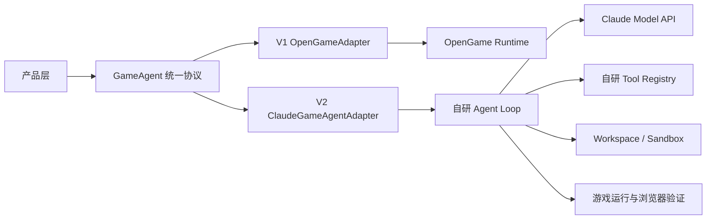

可行，而且这是比“直接深改 OpenGame 内核”更稳的路线。

但有一个关键概念要分清：

> `ClaudeGameAgentAdapter` 如果只是把 Gemini/OpenAI SDK 换成 Claude SDK，它仍然只是更换模型，并不是你自己掌控的 Coding Agent。

真正可控的替换边界应该放在“完整 Agent Runtime”这一层。



## 为什么这个方向合理

OpenGame 当前的价值主要不是它的模型调用，而是已经提供：

- CLI 和 Headless 运行；
- 文件读写、Shell、MCP、Skill；
- Tool Call 循环；
- 权限确认；
- 上下文压缩；
- Template Skill、Debug Skill；
- 游戏资源生成接口。

它适合 V1 快速回答这些产品问题：

- 用户是否真的愿意通过一句话生成游戏；
- 一次生成需要怎样的交互；
- 如何展示生成过程；
- 失败后如何恢复；
- 生成结果如何预览、修改和发布；
- 哪些游戏类型最容易成功。

即使最终不用 OpenGame，这些产品验证、运行数据和失败样例都能保留。

## 从 V1 就要建立正确的抽象

不要让产品代码直接依赖这些 OpenGame 内部概念：

```text
GeminiClient
PartListUnion
GeminiEventType
ToolCallRequestInfo
.qwen/settings.json
```

它们都是 OpenGame/Qwen Code/Gemini CLI 的历史实现细节。

产品层只依赖自己的协议，例如：

```ts
interface GameAgent {
  createRun(input: CreateGameInput): Promise<GameRun>;
  continueRun(runId: string, message: string): Promise<void>;
  cancelRun(runId: string): Promise<void>;
  streamEvents(runId: string): AsyncIterable<GameAgentEvent>;
  getArtifacts(runId: string): Promise<GameArtifact[]>;
}
```

统一事件可以定义成：

```text
run_started
planning
message_delta
tool_started
tool_completed
file_changed
preview_ready
verification_started
verification_failed
verification_passed
run_completed
run_failed
```

V1 中：

```text
OpenGame 原始事件
→ OpenGameAdapter
→ 统一 GameAgentEvent
→ 产品前端
```

V2 中：

```text
自研 Claude Agent Runtime
→ ClaudeGameAgentAdapter
→ 同一套 GameAgentEvent
→ 产品前端无感切换
```

## V2 到底要自己实现什么

真正的 `ClaudeGameAgentAdapter` 至少包括以下六层。

### 1. Agent Loop

```text
用户目标
→ 请求 Claude
→ 解析 Tool Use
→ 执行工具
→ 返回 Tool Result
→ 再请求 Claude
→ 直到完成或触发限制
```

这是 Coding Agent 的核心，不是 Claude SDK 自动提供的全部能力。

### 2. Tool Registry

至少需要：

- `read_file`
- `read_many_files`
- `glob`
- `grep`
- `write_file`
- `edit_file`
- `shell`
- `todo`
- `copy_game_template`
- `generate_assets`
- `run_game`
- `inspect_browser`
- `take_screenshot`

### 3. Workspace 与安全边界

你需要掌控：

- Agent 可以操作哪个目录；
- 哪些命令允许执行；
- 写文件是否需要确认；
- 最大运行时间；
- 子进程和端口回收；
- 资源和 Token 限额；
- 如何取消任务。

### 4. Context Engine

包括：

- 哪些文件进入上下文；
- Tool Result 如何截断；
- 历史何时压缩；
- 修改文件后如何更新上下文；
- 如何防止跨文件状态不一致；
- 如何保存并恢复 Session。

### 5. 游戏验证闭环

这是你自己的 Agent 最有价值的部分：

```text
生成代码
→ npm install/build
→ 启动游戏
→ 浏览器加载
→ 收集 console/page error
→ 截图
→ 执行键盘鼠标脚本
→ 判断画面与玩法状态
→ 修复
→ 重新验证
```

如果只让 Claude 写文件，而没有这个闭环，能力通常不会明显超过普通 Coding Agent。

### 6. 可观测与 Benchmark

每次运行记录：

```text
Prompt
模型和配置
每轮 Tool Call
修改过的文件
构建错误
浏览器错误
修复次数
Token 成本
运行时间
最终验证结果
```

这些数据将决定 V2 到底是否优于 OpenGame。

## 不建议的路线

不建议直接在 OpenGame 的这些类上不断叠加业务：

- `GeminiClient`
- `Turn`
- `CoreToolScheduler`
- `ContentGenerator`

因为这些代码继承链较深，内部数据结构大量使用 `@google/genai` 类型。即使实际调用 Claude 或 OpenAI，核心协议仍带有 Gemini 语义，长期维护成本较高。

也不建议把 `ClaudeGameAgentAdapter` 做成：

```text
OpenGame Runtime
→ AnthropicContentGenerator
→ Claude
```

OpenGame 已经支持这种方式。它只是“OpenGame 使用 Claude 模型”，不是“替换 OpenGame”。

## 推荐演进方式

### V1：产品闭环

- 使用 OpenGame Headless；
- 外面包一层 `OpenGameAdapter`；
- 建立统一事件协议；
- 固化 Workspace 和 Artifact 格式；
- 收集至少一批真实运行轨迹；
- 建立游戏生成 Benchmark。

### V1.5：双跑验证

同一条 Case 同时运行：

```text
OpenGameAdapter
ClaudeGameAgentAdapter
```

比较：

- 构建成功率；
- 游戏可玩率；
- Prompt 意图完成率；
- 修复轮数；
- Token 成本；
- 总耗时；
- 重复或无效 Tool Call 数量。

### V2：切换默认 Runtime

当 Claude Adapter 在核心指标上稳定胜出，再将默认实现从 OpenGame 切换到 Claude，同时保留 OpenGame 作为回退和对照组。

## 最终判断

这条路线技术上高度可行，但正确目标应当是：

> V1 借用 OpenGame 验证产品；V2 自己掌控 Agent Loop、Tools、Workspace、验证闭环和运行数据，Claude 只是其中一个模型 Provider。

真正形成壁垒的不会是 `ClaudeGameAgentAdapter` 这个名字，而是：

```text
游戏专用工具
+ 自动运行验证
+ 失败恢复策略
+ 高质量 Benchmark
+ 从真实轨迹持续改进的能力
```

当前第一步不是修改 OpenGame，而是先定义独立于 OpenGame 的 `GameAgent` 接口和事件协议。这一步做对，后面替换 Runtime 才不会重写整个产品。