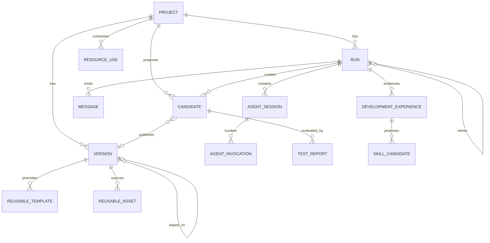

# Data Model: AI 游戏共创平台 V1/V2

**Date（日期）**: 2026-08-07
**Storage（存储）**: SQLite 必要元数据 + 每项目 Git 仓库 + 普通文件路径

## Storage Layout（存储布局）

```text
data/
├── app.db
├── projects/{project_id}/repo/
│   ├── design/gdd.md
│   ├── game-spec.json
│   ├── assets/
│   └── src/
├── workspaces/{run_id}/{agent_session_id}/
├── candidates/{project_id}/{candidate_id}/
├── artifacts/{project_id}/{version_number}/
├── resources/
│   ├── templates/{template_id}/
│   ├── assets/{reusable_asset_id}/
│   └── experiences/{experience_id}.json
├── test-reports/{candidate_id}/{attempt}.json
└── logs/{run_id}/build.log
```

- 每个项目目录相互独立，并包含一个由平台维护的可信 Git 仓库。
- OpenGame 和构建容器只能看到复制出来的 run 工作区，不能看到可信 `.git` 目录。
- SQLite 保存路径与关系；源码、GameSpec、素材、日志和构建产物都是普通文件。
- MVP 预计少于约 10 个演示版本，不实现归档子系统。

## Relationships（关系）



## SQLite Tables（SQLite 表）

### projects

唯一的活动游戏项目。

| 字段 | 类型 | 规则 |
|-------|------|-------|
| `id` | TEXT | UUID primary key |
| `name` | TEXT | Required, 1-80 characters |
| `original_idea` | TEXT | Required and preserved |
| `directory_path` | TEXT | Required path under `data/projects/` |
| `state` | TEXT | `draft`, `waiting_confirmation`, `generating`, `playable`, `failed`, `archived` |
| `latest_candidate_id` | TEXT nullable | Latest candidate/editing snapshot |
| `playable_version_id` | TEXT nullable | Most recently successful version |
| `active_run_id` | TEXT nullable | Global single-task guard |
| `runtime_backend` | TEXT | `opengame` or `claude`, selected by deployment configuration |
| `asset_review_status` | TEXT | `not_started`, `pending_review`, `accepted`, `rejected` |
| `accepted_asset_manifest_path` | TEXT nullable | 用户接受后的 manifest 相对路径 |
| `asset_reviewed_at` | TEXT nullable | 最近人工审阅 UTC timestamp |
| `created_at` | TEXT | UTC timestamp |
| `updated_at` | TEXT | UTC timestamp |

规则：

- MVP 任一时刻只允许一个非 `archived` 项目；V2 复用演示可归档项目 A 后顺序创建项目 B。
- 归档项目仍保留 Version、资源来源和追溯记录，但不能启动新 run 或被 Agent 直接访问。
- `playable_version_id` 只能指向具有现存产物目录的 `succeeded` 版本。
- 启动任何修改任务时，通过即时事务检查 `active_run_id IS NULL` 并设置该字段。
- 任务终结时，只有指针仍指向当前 run 才能清空它。

### runs

一次 AI、构建、重试、恢复执行或版本恢复。

| 字段 | 类型 | 规则 |
|-------|------|-------|
| `id` | TEXT | UUID primary key and public run ID |
| `project_id` | TEXT | Required foreign key |
| `candidate_id` | TEXT nullable | Candidate created by the run |
| `parent_run_id` | TEXT nullable | Original failed/cancelled run for retry/resume |
| `runtime_backend` | TEXT | `opengame` or `claude` |
| `operation` | TEXT | `generate_gdd`, `generate_gamespec`, `generate_assets`, `generate_game`, `modify`, `user_build`, `repair`, `test`, `retry`, `resume`, `restore`, `reuse_resource` |
| `status` | TEXT | `pending`, `running`, `cancelling`, `succeeded`, `failed`, `cancelled` |
| `stage` | TEXT | Normalized stage listed below |
| `request_text` | TEXT nullable | Exact triggering request |
| `agent_name` | TEXT nullable | Adapter ID, normally `opengame` |
| `model_name` | TEXT nullable | Model label when available |
| `workspace_path` | TEXT | Path under `data/workspaces/` |
| `started_at` | TEXT nullable | UTC timestamp |
| `ended_at` | TEXT nullable | UTC timestamp |
| `error_message` | TEXT nullable | Sanitized user-visible error |
| `model_calls` | INTEGER | Non-negative, default 0 |
| `cost_text` | TEXT nullable | Provider-reported value when available |
| `created_at` | TEXT | UTC timestamp |

阶段：

`waiting`, `planning_gdd`, `gdd_review_required`, `planning_gamespec`,
`gamespec_review_required`, `generating_assets`, `asset_review_required`,
`generating_or_modifying_code`, `candidate_created`, `installing_dependencies`,
`validating_build`, `testing`, `repairing`, `retesting`, `version_published`,
`build_failed`, `test_failed`, `cancelled`.

状态转换：

```text
pending -> running -> succeeded
                   -> failed
                   -> cancelling -> cancelled
pending -> cancelled
```

- retry 或 resume 都创建新 run，其 `parent_run_id` 指向原 run。
- resume 始终从项目的 `playable_version_id` 开始，不存在检查点或部分工作区续跑。
- 后端重启时，未终结 run 被标记为失败并记录中断信息，随后可以重新执行。

### agent_sessions

一次 run 中某个领域 Agent 或 OpenGame backend 的受控执行会话。

| 字段 | 类型 | 规则 |
|-------|------|------|
| `id` | TEXT | UUID primary key |
| `run_id` | TEXT | Required foreign key |
| `agent_type` | TEXT | `opengame`, `planning`, `asset`, `coding`, `test` |
| `backend` | TEXT | `opengame` or `claude` |
| `provider_session_id` | TEXT nullable | Claude/OpenGame 原生 session 标识 |
| `status` | TEXT | `pending`, `running`, `succeeded`, `failed`, `cancelled` |
| `workspace_path` | TEXT | 受限 session 工作目录 |
| `tool_policy_id` | TEXT | 固定工具权限策略版本 |
| `attempt` | INTEGER | 同类 Agent 在 run 内从 1 开始递增 |
| `model_name` | TEXT nullable | 实际模型标签 |
| `usage_json` | TEXT nullable | 规范化调用、token、成本数据 |
| `started_at` | TEXT nullable | UTC timestamp |
| `ended_at` | TEXT nullable | UTC timestamp |
| `error_message` | TEXT nullable | Sanitized error |

规则：

- FastAPI 创建并结束 Agent session；Agent 无权创建未声明的后续业务阶段。
- 原生 session 事件必须在持久化前转换为 RunEvent。
- Agent 只能使用 `tool_policy_id` 对应的工具和 Workspace 路径。

### agent_invocations

AgentSession 内一次明确的模型请求、工具驱动回合或 TestAgent 测试调用。Session 表示可持续的
执行上下文，Invocation 表示可计量、可审计的单次调用；OpenGame 无法细分时每个 session 至少
记录一个 invocation。

| 字段 | 类型 | 规则 |
|-------|------|------|
| `id` | TEXT | UUID primary key |
| `agent_session_id` | TEXT | Required foreign key |
| `sequence` | INTEGER | Session 内从 1 单调递增 |
| `kind` | TEXT | `model`, `tool`, `build`, `playtest` |
| `model_name` | TEXT nullable | 实际模型标签 |
| `tool_name` | TEXT nullable | 规范化工具名 |
| `status` | TEXT | `running`, `succeeded`, `failed`, `denied`, `cancelled` |
| `input_ref` | TEXT nullable | 脱敏输入或文件引用，不保存密钥 |
| `output_ref` | TEXT nullable | 脱敏输出、证据或事件范围引用 |
| `usage_json` | TEXT nullable | token、成本和耗时 |
| `started_at` | TEXT | UTC timestamp |
| `ended_at` | TEXT nullable | UTC timestamp |

规则：

- 被权限策略拒绝的工具调用也必须形成 `denied` invocation 和 audit RunEvent。
- Invocation 不拥有业务状态；它不能直接确认设计、接受素材、裁决测试或发布 Version。

### candidates

尚未通过发布门禁的项目变更快照。

| 字段 | 类型 | 规则 |
|-------|------|------|
| `id` | TEXT | UUID primary key |
| `project_id` | TEXT | Required foreign key |
| `run_id` | TEXT | Producing run |
| `parent_version_id` | TEXT nullable | Stable baseline Version |
| `parent_candidate_id` | TEXT nullable | 前一次失败/修复 attempt |
| `attempt` | INTEGER | 变更链内递增 |
| `source` | TEXT | `initial`, `ai`, `user`, `repair`, `restore` |
| `request_text` | TEXT nullable | Exact triggering request |
| `summary` | TEXT | Human-readable change summary |
| `modified_files_json` | TEXT | Safe relative path array |
| `workspace_path` | TEXT | Candidate snapshot path |
| `gamespec_path` | TEXT | Validated GameSpec path |
| `build_status` | TEXT | `pending`, `running`, `succeeded`, `failed`, `cancelled` |
| `test_status` | TEXT | `pending`, `running`, `passed`, `failed`, `invalid`, `cancelled` |
| `published_version_id` | TEXT nullable | Set only after PASS publication |
| `created_at` | TEXT | UTC timestamp |

规则：

- Candidate 不是正式项目历史，不更新 `playable_version_id`。
- repair 创建新的 Candidate attempt，保留前一 Candidate 和失败证据。
- 只有 build succeeded 且有效 TestReport verdict 为 PASS 时才能发布 Version。

### test_reports

| 字段 | 类型 | 规则 |
|-------|------|------|
| `id` | TEXT | UUID primary key |
| `candidate_id` | TEXT | Required foreign key |
| `agent_session_id` | TEXT nullable | V2 TestAgent session；V1 可为空 |
| `attempt` | INTEGER | Candidate 内递增 |
| `build_result` | TEXT | `passed` or `failed` |
| `checks_json` | TEXT | 必需检查项、结果和证据引用 |
| `failed_checks_json` | TEXT | Failed check IDs |
| `evidence_path` | TEXT | Path under `data/test-reports/` |
| `verdict` | TEXT | `pass`, `fail`, `invalid` |
| `created_at` | TEXT | UTC timestamp |

有效报告必须覆盖页面/canvas 启动、阻断控制台错误、玩家移动、敌人核心循环、道具收集、NPC
交互以及至少一个胜利或失败条件。缺少必需检查或证据的 PASS 报告必须改判 `invalid`。

### versions

由通过发布门禁的 Candidate 创建的不可变 Git commit。

| 字段 | 类型 | 规则 |
|-------|------|-------|
| `id` | TEXT | UUID primary key |
| `project_id` | TEXT | Required foreign key |
| `number` | INTEGER | Unique increasing display number per project |
| `parent_version_id` | TEXT nullable | Baseline version |
| `run_id` | TEXT nullable | Producing run |
| `candidate_id` | TEXT | Published Candidate |
| `source` | TEXT | `initial`, `ai`, `user`, `retry`, `restore` |
| `request_text` | TEXT nullable | User request or restore reason |
| `summary` | TEXT | Short human-readable change summary |
| `modified_files_json` | TEXT | JSON array of safe relative paths |
| `git_commit` | TEXT | Required commit SHA |
| `gdd_path` | TEXT | Relative project path, normally `design/gdd.md` |
| `gamespec_path` | TEXT | Relative project path, normally `game-spec.json` |
| `test_report_id` | TEXT | PASS TestReport |
| `build_log_path` | TEXT nullable | Path under `data/logs/` |
| `artifact_path` | TEXT nullable | Required only when succeeded |
| `created_at` | TEXT | UTC timestamp |

规则：

- Version 创建后不可修改，且只代表已经通过构建和测试的发布记录。
- 失败或取消只存在于 Candidate，不创建 Version，也不更新 `projects.playable_version_id`。
- 恢复成功版本会创建新 commit 和版本记录，不 reset 或改写 Git 历史。
- 历史页面按 `number DESC` 显示保留的少量版本。

### reusable_templates

由用户从成功 Version 人工晋升的只读起点快照。

| 字段 | 类型 | 规则 |
|-------|------|------|
| `id` | TEXT | UUID primary key |
| `name` | TEXT | Required |
| `source_project_id` | TEXT | Archived or active source project |
| `source_version_id` | TEXT | Required successful Version |
| `test_report_id` | TEXT | Required PASS TestReport |
| `capability_profile` | TEXT | MVP 固定为 `phaser-survival-v1` |
| `gamespec_schema_version` | TEXT | Compatible schema version |
| `snapshot_path` | TEXT | Path under `data/resources/templates/` |
| `status` | TEXT | `available`, `retired`, `invalid` |
| `reviewed_at` | TEXT | Human promotion timestamp |

平台在晋升时重新检查来源 Version、TestReport 和快照存在性。Template 不代表新增游戏类型，目标
GameSpec capability 或 major schema 不兼容时拒绝使用。

### reusable_assets

| 字段 | 类型 | 规则 |
|-------|------|------|
| `id` | TEXT | UUID primary key |
| `source_project_id` | TEXT | Required source project |
| `source_version_id` | TEXT | Required source Version |
| `source_asset_id` | TEXT | Asset manifest ID |
| `kind` | TEXT | `player`, `enemy`, `item`, `npc`, `background` |
| `style` | TEXT | Structured style label/summary |
| `prompt_text` | TEXT nullable | Original generation prompt when available |
| `provenance_json` | TEXT | Provider/source and generation metadata |
| `license_note` | TEXT | Required public-use note |
| `file_path` | TEXT | Copied file under `data/resources/assets/` |
| `status` | TEXT | `available`, `retired`, `invalid` |
| `reviewed_at` | TEXT | Original Asset Accept or promotion timestamp |

只有来源素材处于 accepted 状态且文件存在时才能创建；复用时复制到目标 Workspace，不能建立指向
来源项目目录的可变链接。

### development_experiences

| 字段 | 类型 | 规则 |
|-------|------|------|
| `id` | TEXT | UUID primary key |
| `source_run_id` | TEXT | Required successful development/repair run |
| `source_candidate_id` | TEXT | Required Candidate |
| `source_version_id` | TEXT | Required published Version |
| `test_report_id` | TEXT | Required PASS TestReport |
| `kind` | TEXT | `development` or `repair` |
| `capability_profile` | TEXT | MVP fixed compatibility tag |
| `problem` | TEXT | Structured problem statement |
| `applicability_json` | TEXT | Preconditions and exclusions |
| `action_summary` | TEXT | Evidence-backed engineering action |
| `modified_files_json` | TEXT | Safe relative paths only |
| `evidence_path` | TEXT | Immutable structured evidence document |
| `status` | TEXT | `draft`, `pending_review`, `available`, `rejected`, `retired`, `invalid` |
| `reviewed_at` | TEXT nullable | Human review timestamp |

CodingAgent 只读取 `available` 记录的结构化字段和证据引用。平台按 capability/profile 和明确标签
过滤，不做 embedding 或向量相似度检索。

### resource_uses

| 字段 | 类型 | 规则 |
|-------|------|------|
| `id` | TEXT | UUID primary key |
| `resource_type` | TEXT | `template`, `experience`, `asset` |
| `resource_id` | TEXT | Referenced approved resource |
| `target_project_id` | TEXT | Consuming project |
| `target_run_id` | TEXT nullable | CodingAgent use or import run |
| `usage` | TEXT | `project_seed`, `asset_copy`, `agent_context` |
| `created_at` | TEXT | UTC timestamp |

### skill_candidates

| 字段 | 类型 | 规则 |
|-------|------|------|
| `id` | TEXT | UUID primary key |
| `source_experience_id` | TEXT | Required reviewed Experience |
| `name` | TEXT | Proposed Skill name |
| `draft_path` | TEXT | Non-active draft document |
| `status` | TEXT | `pending_review`, `approved`, `rejected` |
| `reviewed_at` | TEXT nullable | Independent review timestamp |

创建 Skill Candidate 不会修改 `.agents/skills/` 或运行时 Skill 注册。Formal Skill 的实际安装或
更新属于独立评审变更；MVP 只需证明单次 Run 不会自动晋升。

### messages

供界面显示和 SSE 重连使用的精简追加式 run 消息流。

| 字段 | 类型 | 规则 |
|-------|------|-------|
| `id` | INTEGER | Primary key |
| `run_id` | TEXT | Required foreign key |
| `sequence` | INTEGER | Unique and increasing within run |
| `stage` | TEXT nullable | Current normalized stage |
| `type` | TEXT | `status`, `ai_message`, `tool`, `log`, `error`, `artifact`, `usage`, `test_report`, `audit` |
| `level` | TEXT | `info`, `warning`, `error` |
| `message` | TEXT | Sanitized and length-limited text |
| `progress` | INTEGER nullable | 0-100 when meaningful |
| `agent_session_id` | TEXT nullable | Producing session |
| `agent_invocation_id` | TEXT nullable | Producing invocation |
| `agent_type` | TEXT nullable | Normalized Agent type |
| `candidate_id` | TEXT nullable | Related Candidate |
| `tool_name` | TEXT nullable | Normalized tool name |
| `attempt` | INTEGER nullable | Repair/test attempt |
| `created_at` | TEXT | UTC timestamp |

规则：

- 完整原始构建输出写入 `build_log_path`；messages 只保存界面需要的行。
- 写入消息或展示日志之前必须脱敏密钥与宿主路径。
- SSE 接口先发送指定 sequence 之后的记录，再通过进程内通知器推送新记录；不使用消息代理。

## Project Repository Files（项目仓库文件）

### GDD

`design/gdd.md` 包含已确认的游戏目标、核心循环、玩家、敌人、道具、NPC、胜负条件和美术
风格，并随首次生成版本及后续修改提交。

### GameSpec

`game-spec.json` 遵循 [gamespec.schema.json](contracts/gamespec.schema.json)，并在生成前、AI 修改后、
Monaco 保存后和构建前执行验证。

### Asset Manifest

`assets/manifest.json` 只记录：

- `id`、`kind`、相对 `path` 和 MIME 类型。
- `source`：`generated`、`integrated` 或 `builtin_placeholder`。
- 公开演示所需的简短来源/许可说明。

生成失败时，平台从 `game-template/public/placeholders/` 复制对应文件，写入
`builtin_placeholder`，发送警告消息并继续核心构建。

素材工作流状态由 `projects.asset_review_status` 保存：AssetAgent/OpenGame 提交 draft 后变为
`pending_review`；用户可拒绝并重新生成，或接受全部选中素材后变为 `accepted`。只有 `accepted`
状态和对应 manifest 路径同时存在时，FastAPI 才能启动 CodingAgent/OpenGame 编码阶段。Agent
不能写入该状态。

## Transactions（事务）

### 启动任务

1. 开始即时 SQLite 事务。
2. 任一项目的 `active_run_id` 非空时返回 `409 task_running`。
3. 创建 run 并设置 `active_run_id`。
4. 提交事务，然后启动唯一的进程内任务。

### 完成成功版本

1. 验证 Candidate 的构建状态和有效 PASS TestReport。
2. 将允许的 Candidate 变化导入可信项目仓库并创建 Git commit 与不可变 Version。
3. 写入产物目录，在一个 SQLite 事务中发布 Version、设置版本指针并清除活动 run。

### 失败或取消

1. 保留脱敏日志、Candidate snapshot、TestReport 和错误证据。
2. 在一个事务中将 run/Candidate 标记为失败或取消，并清除活动 run。
3. 不改变 `playable_version_id` 及其产物目录。

### Retry、resume 或 restore

1. 要求当前没有活动 run。
2. retry/resume 选择最近成功 commit；restore 选择用户指定的成功 commit。
3. 从该干净 commit 创建新 run 和工作区。
4. 完整执行修改与构建，不复用中间状态。

### Resource promotion 与 reuse

1. promotion 事务先验证来源状态、人工门禁、PASS TestReport、文件存在性和兼容标签。
2. 将只读快照或证据写入临时资源目录，完成后原子 rename，再插入 `available` 元数据。
3. reuse 要求目标为当前唯一活动项目；平台复制资源到新 Workspace 并写入 `resource_uses`。
4. CodingAgent 只能通过 `get_approved_experiences` 读取过滤后的 Experience；读取也写 ResourceUse。
5. 资源失效只改变 status，不删除来源和历史使用记录。

## Access Code（访问码）

部署级访问码属于配置而非用户实体。FastAPI 将其与环境变量值比较，并签发带签名和过期时间的
cookie；不创建账号、角色、密码重置或管理员会话表。
