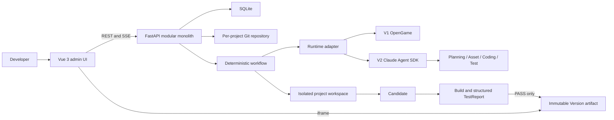

# Implementation Plan: AI 游戏共创平台 V1/V2

**Branch（分支）**: `001-game-creation-mvp` | **Date（日期）**: 2026-08-07 | **Spec（规格）**: [spec.md](spec.md)

**Input（输入）**: 功能规格来自 `/specs/001-game-creation-mvp/spec.md`

## Summary

采用分阶段 Agent Runtime Roadmap 完成创意到在线试玩闭环。Vue 3 管理界面负责 GDD/GameSpec
确认、素材审阅、任务日志、Monaco 编辑、iframe 预览和版本历史；FastAPI 作为确定性业务工作流，
负责 REST、SSE、SQLite、Workspace、Candidate、Git Version、测试裁决和产物发布；固定
Phaser 3 模板负责唯一的 2D 俯视角生存玩法与确定性 NPC。

Platform V1 通过 GameAgentAdapter → OpenGameAdapter → OpenGame 建立 baseline。Platform V2
通过 Claude Agent SDK 实现 ClaudeRuntimeAdapter，并由 FastAPI 顺序编排 PlanningAgent、
AssetAgent、CodingAgent 和 TestAgent。Agent 只提交结构化结果；GDD Confirm、GameSpec Confirm、
Asset Accept、Test PASS 与 Version Publish 始终由平台控制。OpenGame 在 V2 保留为 fallback、
reference 和 benchmark。

每个项目使用独立目录和 Git 仓库。全平台同时只执行一个变更工作流，不使用消息队列。变更先
形成 Candidate，只有构建和结构化 TestReport 通过后才发布不可变 Version。失败或取消不改变
最近成功版本；恢复从最近成功 commit 重新执行，不实现通用阶段检查点。

V2 增加一个人工审核的 Reusable Resource Catalog：成功 Version 可晋升为兼容固定能力的 Template，
已接受 Asset 可保存并复制到后续隔离项目，成功 development/repair run 可形成带 PASS 证据的
Development Experience 并通过只读工具提供给 CodingAgent。目录不使用向量库，不自动提取模板、
聚类经验或修改 Formal Skill。

## Technical Context

**Language/Version（语言与版本）**: 前端使用 Node.js 22 LTS 与 TypeScript 5.9；后端使用
Python 3.11+

**Primary Dependencies（主要依赖）**: Vue 3.5、Vite 7.3、Monaco Editor 0.55；FastAPI 与
Python 标准库 `sqlite3`/`asyncio.subprocess`；V1 OpenGame CLI；V2 Claude Agent SDK；
Phaser 3.90、Ajv 8、Playwright Chromium

**Storage（存储）**: 一个 SQLite 文件保存必要元数据；每个项目一个独立 Git 仓库；工作区、
日志、素材、版本构建产物和可复用资源快照使用普通文件路径

**Testing（测试）**: pytest 验证后端状态与 API；`vue-tsc` 和 Vite 生产构建验证前端；游戏模板
执行类型与构建检查；仅保留一个 Chromium Playwright 端到端冒烟流程

**Target Platform（目标平台）**: 现代桌面浏览器；一台使用 Docker Compose 的 Linux 主机；
每次运行使用隔离 Docker 工作区

**Project Type（项目类型）**: Vue 前端 + FastAPI 模块化单体 + 固定 Phaser 游戏模板

**Performance Goals（性能目标）**: 5 秒内显示 run ID/状态；SSE 更新在产生后 5 秒内可见；
10 秒内显示明确取消状态；20 分钟内从创意到试玩；10 分钟内完成一次受支持的 AI 修改

**Constraints（约束）**: 两名开发者；截止日期 2026-08-19；单用户；任一时刻只有一个活动项目，
V2 可归档后顺序创建第二个隔离演示项目；
全局只运行一个任务；固定 Phaser 俯视角生存模板；NPC 运行时不调用大模型；无终端；文件编辑
采用白名单；失败构建绝不替换可玩版本

**Scale/Scope（规模与范围）**: 一个活动项目、至多两个顺序演示项目、一个活动工作流、每个 run
至多四类受控 Agent session、约少于 10 个演示版本和少量人工批准资源；不为大量事件、水平扩容、
向量检索或自动归档做设计

## Constitution Check

*GATE: Must pass before Phase 0 research. Re-checked after Phase 1 design.*

### Pre-Research Gate

| 原则 | 状态 | 规划依据 |
|-----------|--------|-------------------|
| I. 端到端可演示优先 | PASS | 计划从完整的创意、GDD、GameSpec、构建到试玩闭环开始。 |
| II. 严格控制 MVP 范围 | PASS | 仅包含单用户、单活动项目、单 Phaser 能力模板和演示必需的顺序复用。 |
| III. AI 与用户共同编辑同一个项目 | PASS | OpenGame 与 Monaco 编辑同一个项目 Git 仓库。 |
| IV. Agent Runtime 必须分阶段且可替换 | PASS | V1 OpenGame 与 V2 Claude Runtime 共用平台契约，FastAPI 不依赖供应商事件格式。 |
| V. AI 执行必须隔离 | PASS | AI、npm 和构建命令在 run 专属 Docker 工作区执行。 |
| VI. 全过程可观察、可取消、可恢复 | PASS | SQLite 消息、SSE、子进程取消和最近成功版本重跑覆盖全过程。 |
| VII. 每次修改必须版本化 | PASS | 变更先形成 Candidate，只有通过发布门禁才创建不可变 Version。 |
| VIII. 可玩性是完成标准 | PASS | 发布前必须通过生产构建和结构化 Chromium TestReport。 |
| IX. NPC 能力保持结构化和可控 | PASS | GameSpec 将 NPC 限定为确定性的站立、巡逻和逃跑行为。 |
| X. 需求和产物必须可追溯 | PASS | SQLite 关联项目、run、版本、需求、commit、日志和产物路径。 |
| XI. 成本和复杂度必须受控 | PASS | V2 仅引入四种受控 Agent profile/session，不拆微服务，不允许 LLM 自由编排。 |
| XII. 在线交付优先 | PASS | 明确交付单机 Compose、稳定演示游戏和视频。 |
| XIII. 只有经过验证和审阅的开发知识才能复用 | PASS | Template、Experience 和 Asset 都要求来源证据与人工批准，Skill 不能自动晋升。 |

无需 Constitution 例外。

### Post-Design Gate

| 必要门禁 | 状态 | 设计依据 |
|---------------|--------|-----------------|
| Vue 3 + FastAPI 技术栈一致 | PASS | plan、research、quickstart 与源码结构只采用指定技术栈。 |
| 共享项目与 Git 版本 | PASS | [data-model.md](data-model.md) 定义项目目录和版本 commit。 |
| Runtime 保持可替换 | PASS | [game-agent-adapter.md](contracts/game-agent-adapter.md) 定义 OpenGame 与 Claude Runtime 的统一平台边界。 |
| 隔离和编辑白名单可测试 | PASS | research 第 8 节与 quickstart 安全场景均有覆盖。 |
| 失败不能替换成功版本 | PASS | latest/playable 指针分离，并采用成功晋升事务。 |
| Candidate/Version 与恢复语义明确 | PASS | Candidate 可修复重测，Version 仅由 PASS Candidate 发布；resume 从最近成功 commit 创建新 run。 |
| 核心玩法可验证 | PASS | GameSpec schema 配合单个 Chromium 冒烟契约。 |
| 范围排除额外基础设施 | PASS | 不含 Redis、队列、Kubernetes、复杂备份监控或多浏览器矩阵。 |
| 可复用知识门禁明确 | PASS | 资源目录只接受验证成功和人工批准的记录，并保留来源与 ResourceUse。 |

设计后 Constitution 检查通过，无例外或未解决澄清项。

## Project Structure

### Documentation (this feature)

```text
specs/001-game-creation-mvp/
├── plan.md
├── research.md
├── data-model.md
├── quickstart.md
├── review-guide.md          # 两人共同评审入口
├── contracts/
│   ├── game-agent-adapter.md
│   ├── agent-profile-policy.md
│   ├── gamespec.schema.json
│   ├── openapi.yaml
│   ├── run-event.schema.json
│   ├── reusable-resource.schema.json
│   ├── test-report.schema.json
│   └── runtime-benchmark.md
├── checklists/requirements.md
└── tasks.md                 # 下一步由 $speckit-tasks 生成
```

### Source Code (repository root)

```text
frontend/
├── src/
│   ├── api/                 # fetch client and EventSource connection
│   ├── components/          # Compact reusable controls
│   ├── composables/         # Project, run and editor state
│   ├── views/               # Create, design, workspace and history views
│   ├── editor/              # Monaco configuration and diagnostics
│   └── main.ts
└── tests/                   # Minimal UI smoke helpers

backend/
├── app/
│   ├── api/                 # FastAPI routes and SSE endpoint
│   ├── models/              # Pydantic request/response models
│   ├── repositories/        # Explicit sqlite3 and Git/file operations
│   ├── services/            # Projects, candidates, versions, tests and publication
│   │                         # plus reviewed reusable-resource catalog
│   ├── runtimes/            # GameAgentAdapter, OpenGameAdapter, ClaudeRuntimeAdapter
│   ├── agents/              # Planning/Asset/Coding/Test profiles and policies
│   ├── tools/               # Typed game-platform and MCP tool gateways
│   ├── execution/           # Single-task lock and Docker runner
│   ├── security/            # Access code, path whitelist and log redaction
│   └── main.py
├── migrations/              # Small ordered SQL files
└── tests/
    ├── contract/            # Runtime and normalized-event contract tests
    └── integration/         # OpenGame and Claude workflow tests

game-template/
├── src/
│   ├── spec/                # GameSpec loader and validation
│   ├── game/                # Phaser scenes and entities
│   ├── npc/                 # Deterministic NPC behavior
│   └── test-bridge.ts       # Read-only Chromium smoke state
├── public/placeholders/     # Built-in fallback art
└── tests/smoke.spec.ts

deploy/
├── compose.yaml
├── backend.Dockerfile
├── runner.Dockerfile
└── proxy/

data/                        # Gitignored runtime volume
├── app.db
├── projects/
├── workspaces/
├── artifacts/
├── resources/               # Approved templates, assets and experience evidence
└── logs/
```

**Structure Decision（结构决策）**: 采用三部分应用结构。frontend 与 game-template 使用 Node
工具链，所有平台业务状态机和 Runtime 编排位于 Python backend；四个领域 Agent 是受控 profile/
session，不建立独立部署 worker 或 Agent 微服务。

## Design Overview



### Platform V1 Flow

1. FastAPI validates the deployment access code and request.
2. SQLite transaction rejects an existing active task, creates run metadata and records the baseline version.
3. Backend copies the baseline project into `data/workspaces/{run_id}` and starts the restricted runner.
4. OpenGame or a user edit changes only allowed files；平台创建 Candidate 并记录规范化 RunEvent。
5. Backend validates GameSpec, runs the production build and Chromium playtest。
6. 平台验证结构化 TestReport；仅 PASS Candidate 导入可信仓库、创建 Version commit 并更新
   `playable_version_id`，失败保留诊断和旧可玩产物。

### Platform V2 Flow

1. FastAPI 创建 run，并启动 PlanningAgent session 生成 GDD；人类确认后才生成 GameSpec。
2. GameSpec 确认后启动 AssetAgent；素材必须通过平台 Asset Accept 门禁。
3. CodingAgent 在隔离 Workspace 中创建或增量修改游戏，并提交 Candidate。
4. 平台执行确定性构建，再由 TestAgent 进行 playtest 并提交结构化 TestReport。
5. FAIL 时平台在预算内启动 CodingAgent repair 和 TestAgent retest；PASS 时平台发布 Version。
6. Claude 原生消息、工具调用、用量和错误全部映射为 RunEvent，并关联 run/AgentSession。
7. PASS Version、accepted Asset 或成功 run 只有在用户批准后才能进入 Resource Catalog；
   CodingAgent 仅通过只读检索工具获得兼容且 `available` 的 Experience。

### Reusable Knowledge Flow

1. 平台验证来源 Version/Run 的 PASS TestReport，或 Asset 的人工接受、来源和许可字段。
2. 用户执行 promote；FastAPI 创建不可变资源记录和普通目录快照，不让 Agent 自行批准。
3. Template 与 Experience 使用固定 capability tag 精确匹配；MVP 不做向量召回或聚类。
4. 归档当前活动项目后创建第二个隔离项目，平台复制 Template/Asset，并创建 ResourceUse。
5. CodingAgent 可读取已批准 Experience 的结构化摘要与证据引用，但看不到来源项目 Workspace。
6. Experience 只能创建 Skill Candidate；Formal Skill 晋升是独立人工审阅动作，不由本流程自动执行。

## Delivery Milestones

V1 与 V2 使用同一代码库和平台工作流，但按两个门禁独立验收。日期是两人团队从
2026-08-10 到 2026-08-19 的结项倒排；功能冻结后只处理阻断闭环的问题。

| 日期 | 里程碑产物 | 通过门禁 |
|------|------------|----------|
| 08-10 | 文档与契约冻结；OpenGame/Claude SDK spike 开始 | Adapter 名称、事件、权限和 Candidate/Version 语义无歧义 |
| 08-11 | FakeAdapter + SQLite + 单任务 Workflow + SSE | GDD/GameSpec/素材人工门禁和失败指针保护通过集成测试 |
| 08-12 | 固定 Phaser 模板 + Docker 构建 + Chromium gate | 占位素材可完成 build/playtest/TestReport |
| 08-13 | **V1 OpenGame Baseline** | 创建、增量修改、失败保护和三次 benchmark 可重复 |
| 08-14 | ClaudeRuntimeAdapter + PlanningAgent/AssetAgent | session/event 规范化、工具拒绝和两个人工门禁通过 |
| 08-15 | CodingAgent + Candidate | create/modify 只写授权 Workspace，不能直接发布 Version |
| 08-16 | TestAgent + repair/retest | 结构化 FAIL → repair → retest → PASS 受 FastAPI 预算控制 |
| 08-17 | **V2 Claude Runtime + Reuse Gate** | 创建、修改、修复闭环通过；Template、Asset、Experience 三项最小复用演示通过 |
| 08-18 | 在线部署、三次演练、演示视频和说明文档 | 干净浏览器可访问，稳定 V1 兜底不受 V2 状态影响 |
| 08-19 | 汇报缓冲与最终证据归档 | 不新增功能；如实标记 V1/V2 各自完成状态 |

**V1 完成定义**：OpenGameAdapter 能通过统一契约完成 GameSpec → Coding → Candidate → Build →
TestReport → Version，并保留最近成功预览。

**V2 完成定义**：ClaudeRuntimeAdapter 在同一 FastAPI Workflow 下完成 Planning、Asset、Coding、
Test 四类 Agent、人工门禁、创建、增量修改和受控 repair/retest。只有 OpenGame 可运行或只有 Claude
SDK 能返回消息都不构成 V2 完成。V2 还必须完成一个 Template 晋升、一个 Asset 跨顺序项目复用
和一条可供 CodingAgent 读取的成功 Experience。

若 V2 在截止前只完成部分能力，必须保留已验证的 V1 在线演示，并在报告中以证据标记 V2
“未完成”及剩余项；不得降低安全、TestReport 或 Version Publish 门禁来制造表面完成。

### Recovery Flow

- cancel 终止子进程/容器，保持 `playable_version_id` 不变。
- retry/resume 从最近成功 Git commit 创建新 run，并复用原始需求。
- repair 在同一变更链路下创建新的 Candidate attempt，并重新执行 TestAgent。
- restore 选择一个已显示的成功 Version，以其创建 Candidate，重新验证后发布新 Version。
- 不实现通用阶段检查点、任意部分工作区续跑或 LLM 自由工作流编排。

## Complexity Tracking

不存在 Constitution 违规或复杂度例外。本修订明确排除 React、Fastify、Node.js 后端、ORM、
Redis、任务队列、内容寻址存储、通用阶段检查点、三浏览器自动化、复杂备份监控、Kubernetes、
Agent 微服务、LLM 自由编排和多模板设计。V2 的四类领域 Agent 属于最终目标，不再作为排除项。
可复用资源目录不改变这一结论：自动模板提取、向量检索、经验聚类和自动 Skill 晋升仍被排除。
